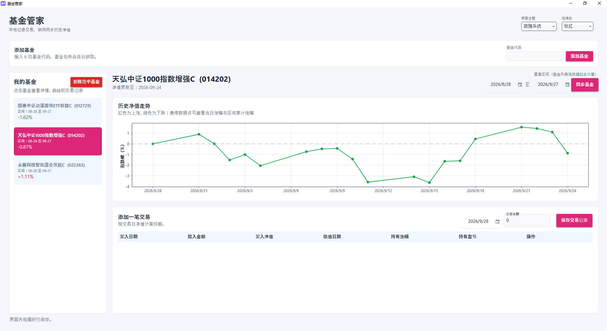
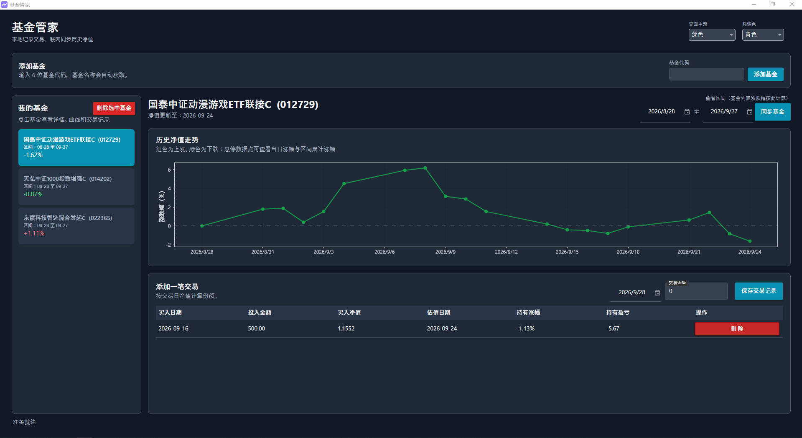

# 基金管家（FundSingleTrade）

一个基于 **WPF + .NET 8** 的本地基金持仓管理工具。它在本地记录你的每一笔基金买入，联网同步东方财富的基金名称与历史单位净值，并为你展示区间涨跌幅、净值走势曲线和每笔交易的持有收益。

所有业务数据都保存在本机，不上传任何服务器；联网仅用于拉取公开的基金行情接口。

---

## 界面预览

| 浅色主题 | 深色主题 |
| :---: | :---: |
|  |  |

---

## 功能特性

- **基金列表管理**：输入 6 位基金代码即可添加，自动获取基金中文名称；支持删除基金（连同其净值与交易记录）。
- **历史净值同步**：按指定日期区间从东方财富接口分页拉取历史单位净值，增量写入本地数据库。
- **区间涨跌幅**：在左侧列表中按选定区间自动计算每只基金的涨跌幅，涨红跌绿（遵循 A 股配色习惯）。
- **净值走势图**：使用 ScottPlot 绘制区间累计涨跌幅曲线，鼠标悬停数据点可查看当日涨幅、区间累计涨幅和单位净值。
- **单笔交易记录**：录入买入日期与金额，自动按交易日（或最近 15 天内）净值计算买入份额。
- **持有收益汇总**：以最近一次同步的净值为估值基准，实时计算每笔交易的持有涨幅与浮动盈亏。
- **主题与配色**：支持跟随系统 / 浅色 / 深色三种主题，以及 7 种强调色，切换即时生效并持久化保存。
- **数据本地化**：基金、净值、交易与偏好设置全部保存在用户本地应用数据目录，方便备份与迁移。

---

## 技术栈

| 用途 | 技术 |
| --- | --- |
| 桌面框架 | WPF（.NET 8，`net8.0-windows`） |
| MVVM | CommunityToolkit.Mvvm 8.4.0 |
| 本地存储 | Entity Framework Core + SQLite 9.0.9 |
| 图表绘制 | ScottPlot.WPF 5.0.55 |
| UI 主题 | MaterialDesignThemes 5.2.1 |
| 行情数据 | 东方财富公开接口（基金搜索 / 历史净值） |

---

## 项目结构

```
FundSingleTrade/
├── FundSingleTrade.sln                 # 解决方案文件
├── docs/                               # 界面截图（README 使用）
│   ├── screenshot-light.jpg
│   └── screenshot-dark.jpg
└── FundSingleTrade.Shell/              # 唯一的 WPF 应用项目
    ├── App.xaml(.cs)                   # 应用入口，启动时应用主题
    ├── MainWindow.xaml(.cs)            # 主窗口布局与 ScottPlot 图表交互
    ├── DateTextConverter.cs            # 日期显示/回填转换器
    ├── ThemeManager.cs                 # 明暗主题与强调色统一管理
    ├── Data/
    │   ├── FundDbContext.cs            # EF Core 上下文与本地数据目录
    │   ├── Models.cs                   # Fund / FundCategory / Trade / FundQuote 实体
    │   └── UserPreferencesStore.cs     # 主题偏好 JSON 读写
    ├── Services/
    │   ├── FundDataService.cs          # 东方财富接口调用与解析
    │   └── ConfirmationDialogService.cs# 主题化的确认弹窗
    └── ViewModels/
        └── MainViewModel.cs            # 主视图模型：基金、交易、区间与偏好
```

---

## 环境要求

- **操作系统**：Windows 10 / 11
- **运行时**：.NET 8 SDK（开发）或 .NET 8 Desktop Runtime（仅运行）
- **网络**：可访问 `fund.eastmoney.com` / `api.fund.eastmoney.com`

---

## 构建与运行

### 使用命令行

```bash
# 进入解决方案目录
cd "FundSingleTrade"

# 还原依赖并构建
dotnet build FundSingleTrade.sln -c Release

# 运行
dotnet run --project FundSingleTrade.Shell/FundSingleTrade.Shell.csproj
```

### 使用 Visual Studio / Rider

1. 用 Visual Studio 2022 或 JetBrains Rider 打开 `FundSingleTrade.sln`。
2. 将 `FundSingleTrade.Shell` 设为启动项目。
3. 直接运行（F5）即可。

构建产物位于 `FundSingleTrade.Shell/bin/<Configuration>/net8.0-windows/`，可执行文件名为 `基金管理.exe`。

---

## 使用说明

### 1. 添加基金

在顶部「添加基金」区域输入 **6 位数字基金代码**（如 `000001`），点击「添加基金」。程序会自动查询并同步基金名称与最近净值。

### 2. 选择区间并同步

在右侧选择「起始日期 / 结束日期」，点击「同步基金」，程序会拉取该区间（并向前多取约 15 天，用于计算首日涨幅）的净值并写入本地库。左侧列表会按此区间显示每只基金的涨跌幅。

### 3. 查看净值走势

在左侧点击任意基金，右侧会显示其净值走势：

- 曲线为**区间累计涨跌幅**（以区间首个净值为基准）。
- 整体红色表示区间上涨，绿色表示下跌。
- **鼠标悬停**数据点可查看：日期、当日涨幅、区间累计涨幅、单位净值。

### 4. 记录一笔交易

在「添加一笔交易」区域填写：

- **交易日期**：买入当天（若为非交易日，会取最近 15 天内可用的净值）。
- **交易金额**：本次投入的金额。

点击「保存交易记录」，程序按交易日净值计算买入份额，并自动刷新最新估值。

### 5. 查看与删除交易

下方表格展示每笔交易的：买入日期、投入金额、买入净值、估值日期、持有涨幅、持有盈亏。点击行尾的「删除」并在弹窗中确认即可移除该笔记录。

### 6. 切换主题

右上角可切换「界面主题」（跟随系统 / 浅色 / 深色）与「强调色」，选择后立即生效，并自动保存到本地。

---

## 数据存储

所有本地数据位于：

```
%LOCALAPPDATA%\FundSingleTrade\
├── funds.db        # SQLite 数据库（基金、净值、交易）
└── settings.json   # 主题与强调色偏好
```

备份或迁移时，直接复制整个 `FundSingleTrade` 目录即可。

---

## 数据来源

行情数据来自东方财富公开接口：

- 基金名称：`https://fundsuggest.eastmoney.com/FundSearch/api/FundSearchAPI.ashx`
- 历史净值：`https://api.fund.eastmoney.com/f10/lsjz`

接口可用性、数据准确性与访问频率限制均由服务方决定，本工具不对其可用性作出保证。

---

## 免责声明

本工具仅用于**个人学习与持仓记录**，所有收益数据均为基于历史净值的估算，不构成任何投资建议。基金净值、涨跌幅等数据以基金公司正式披露为准。据此进行投资决策所产生的风险由使用者自行承担。

---

## 许可证

本项目基于 [MIT License](LICENSE) 开源。
